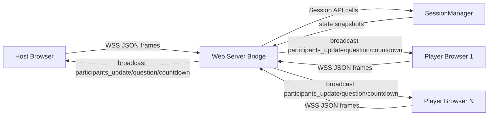

# Secure Multi-Client Quiz System — Final Architecture & Implementation Report

Date: 27 March 2026

## 1) Problem Definition and Architecture

### Problem Statement

Build a secure real-time quiz platform where multiple clients can join concurrently, one host controls quiz start, all participants receive synchronized quiz state, and the system remains robust under disconnects/reconnects.

### Objectives

- Correctly separate host and player roles.
- Support multiple simultaneous clients.
- Keep all clients synchronized for lobby, countdown, active question, and completion.
- Use low-level socket programming with explicit connection handling.
- Add transport security using TLS.

### Architecture Choice

A client-server, multi-client distributed architecture is used:

- **Core socket quiz server**: `Server/quiz_socket_server.py` + `Server/client_handler.py`
- **Web HTTPS/WebSocket server**: `Server/web_server.py`
- **Shared state engine**: `Server/session_manager.py`
- **Browser clients**: `Server/frontend/*` and `client/frontend/*`
- **Optional local bridge**: `client/local_bridge.py` for browser-to-TLS forwarding

### Component Interaction Flow

### Protocol Design (JSON)

Client actions:

- `join`: `{ action, username, host }`
- `start_quiz`: `{ action }`
- `submit_answer`: `{ action, answer, client_sent_ts }`
- `ping`: `{ action }`

Server events:

- `welcome`
- `participants_update`
- `quiz_countdown`
- `question`
- `answer_result`
- `question_closed`
- `quiz_finished`
- `start_rejected`, `error`

## 2) Core Implementation (Socket Programming)

The implementation explicitly uses low-level socket APIs:

- Socket creation (`socket.socket`)
- Binding/listening (`bind`, `listen`, `accept`)
- Connection handling per client with threads
- Framed/buffered data transmission
- Explicit TLS wrapping using `ssl.SSLContext`

Implemented in:

- `Server/quiz_socket_server.py`
- `Server/client_handler.py`
- `Server/web_server.py`
- `client/local_bridge.py`

## 3) Feature Implementation — Deliverable 1

### Completed Features

- Host joins correctly as host (`is_host` + `role` handling fixed).
- Host-only start control is enforced by server-side state checks.
- Live participant monitoring is broadcast to all clients via `participants_update`.
- Host monitor panel and participant lists update dynamically in waiting and quiz screens.
- Countdown synchronization (`quiz_countdown`) shared across clients.
- Late joiners receive state snapshot (`quiz_start_ts`, `current_question`) and synchronize correctly.
- Question timing and deadline are server-authoritative.

### Security

- TLS/SSL is used for server-client transport.
- HTTPS + WSS path in web mode.
- TLS socket mode in raw client/server mode.

## 4) Performance Evaluation Plan

To evaluate realistic behavior, test with concurrent clients (e.g., 5, 10, 20).

### Metrics

- Lobby update latency for `participants_update`
- Countdown synchronization drift across clients
- Question broadcast delay
- Answer processing latency and acceptance/rejection consistency
- Throughput (messages/sec) under load

### Suggested Method

1. Start server and connect N clients.
2. Join simultaneously, track time from join to roster update on all screens.
3. Trigger host start and compare countdown display timestamps.
4. Submit answers near deadline to validate fairness and timeout handling.
5. Record logs and compute mean/p95 latency.

## 5) Optimization and Fixes Applied

### Fixes Implemented

- Fixed host-role mismatch (`Join as Host` no longer appears as player).
- Added host reassignment protection when old host disconnects.
- Added global `participants_update` broadcasting on join/disconnect/start/question transitions.
- Added quiz state snapshot fields in `welcome` for proper late-join sync.
- Added frontend handling for participant live updates and host monitor UI.
- Removed/guarded fragile DOM access for missing loader element.

### Stability and Edge Cases

- Handles reconnect/rejoin state restoration.
- Handles abrupt disconnect by marking participant disconnected.
- Prevents duplicate answer submissions.
- Rejects invalid start attempts from non-host users.
- Maintains server-authoritative timing and state.

## Run/Verification (Quick)

### Web mode

- Run: `python Server/web_server.py`
- Open clients at: `https://<server-ip>:8443`

### Socket mode

- Run server: `python Server/quiz_socket_server.py`
- Run clients: `python Server/quiz_socket_client.py --username Alice` (use `--host-mode` for host)

### Expected Behavior Checklist

- Host checkbox join gets host controls.
- Participant list updates for everyone on every new join.
- Host monitor visible to host only.
- Countdown visible and synchronized on all clients.
- Late joiner receives active countdown/question state.
- Quiz progresses consistently for all connected clients.
